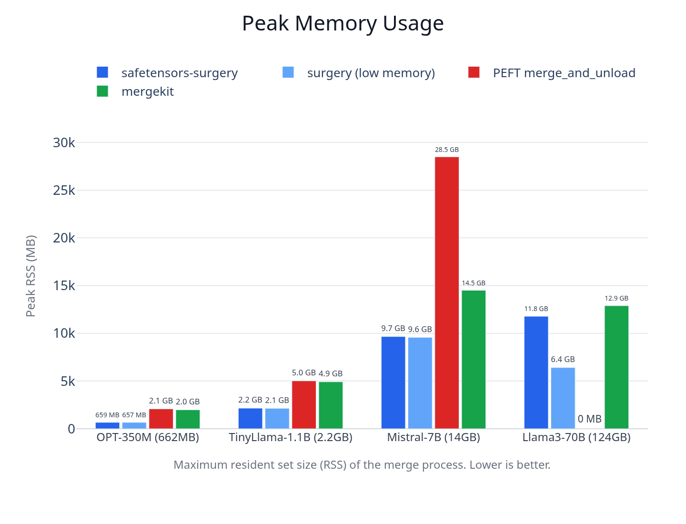
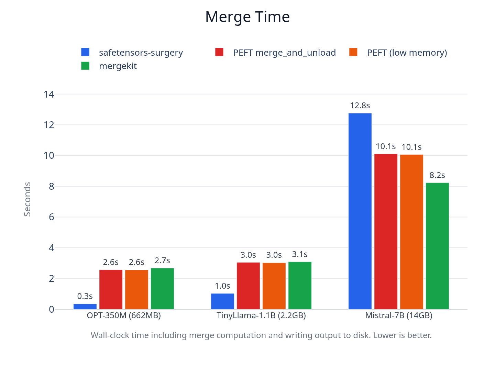
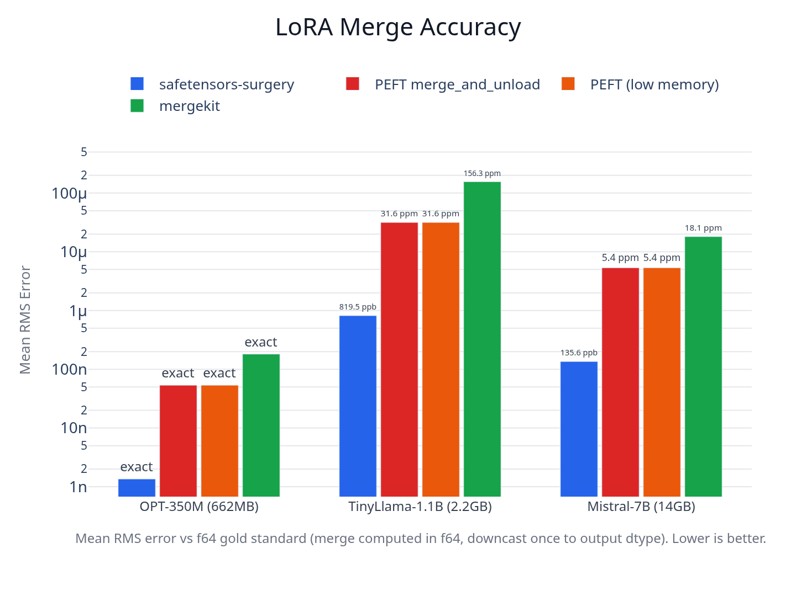

# safetensors-surgery

[](https://github.com/RoloPineda/safetensors-surgery/actions/workflows/ci.yaml)
[](LICENSE)

`safetensors-surgery` merges PEFT LoRA adapters into safetensors base models using memory-mapped I/O. It processes tensors one at a time, so a 14B model merges in under 20 seconds using 4GB of RAM. The standard Python workflow needs 57GB for the same operation.

## Why this tool

Merging a LoRA adapter into a base model with PEFT's `merge_and_unload` requires loading the entire model into memory. For Mistral-7B that's 28GB of RAM. For a 14B model it's 57GB. mergekit needs less (14GB for Mistral-7B) but still scales linearly with model size. If you train on a rented GPU and want to merge on your laptop, you're stuck. You either keep the GPU running (paying by the hour), merge in the cloud, or serve with the adapter applied at runtime (slower inference).

`safetensors-surgery` solves this by memory-mapping the base model and processing one tensor at a time. Mistral-7B merges in 10GB. A 14B model merges in 4GB. No Python, no PyTorch, runs on any machine, finishes in seconds.

### Tradeoffs

**What you get:** 2-13x less memory than PEFT, higher merge precision (f64 math with single-step downcast), 100% bit-identical passthrough on non-LoRA tensors, no Python or PyTorch dependency at runtime.

**What you give up:** On 7B+ models, the f64 matmul makes surgery slower than mergekit and PEFT on wall-clock time. The output always preserves the base model's dtype (no built-in conversion to a different precision). Only PEFT-format LoRA adapters are supported (no MLX, no multi-adapter merge methods like TIES/DARE/SLERP).

## Contents

- [Why This Tool](#why-this-tool)
- [Installation](#installation)
- [Usage](#usage)
- [How It Works](#how-it-works)
- [Performance](#performance)
- [Supported Formats](#supported-formats)
- [Adapter Config Options](#adapter-config-options)
- [Current Known Limitations](#current-known-limitations)
- [Benchmarks](#benchmarks)

## Installation

### CLI (from source)

```sh
git clone https://github.com/RoloPineda/safetensors-surgery.git
cd safetensors-surgery
cargo install --path cli
```

### Python

```sh
pip install safetensors-surgery
```

## Usage

### CLI

```sh
# Single-file base model
safetensors-surgery merge \
  --base-model ./Mistral-7B-v0.1 \
  --adapter ./my-lora-adapter \
  --output ./merged-model.safetensors

# Sharded base model (output is a directory with shards + index.json)
safetensors-surgery merge \
  --base-model ./Qwen2.5-14B \
  --adapter ./my-lora-adapter \
  --output ./merged-model

# Preview what will happen without writing anything
safetensors-surgery merge \
  --base-model ./Mistral-7B-v0.1 \
  --adapter ./my-lora-adapter \
  --output ./merged-model.safetensors \
  --dry-run
```

### Python

```python
import safetensors_surgery

# Merge
safetensors_surgery.merge(
    base_path="./Mistral-7B-v0.1",
    lora_path="./my-lora-adapter",
    output_path="./merged-model.safetensors",
)

# Inspect without merging
info = safetensors_surgery.inspect("./Mistral-7B-v0.1", "./my-lora-adapter")
print(info)
```

## How It Works

The base model is memory-mapped, not loaded into RAM. For each LoRA target tensor, the base weight, lora_A, and lora_B are read, the merge `base + (alpha / r) * (B @ A)` is computed in f64, the result is downcast to the output dtype in a single step, and the buffer is freed before moving to the next tensor. Non-LoRA tensors are byte-copied from the mmap to the output without allocation or conversion. For sharded models, each shard is opened and closed independently.

## Performance







Benchmarked on an AMD Ryzen 9 9950X3D, 128GB DDR5, 1TB NVMe. Median of 3 runs. Full methodology and reproduction instructions in [`benchmarks/`](benchmarks/).

| Model | Tool | Peak RSS | Time | LoRA RMS Error | Passthrough |
|:---|:---|---:|---:|---:|---:|
| **OPT-350M** (fp16) | surgery | **660 MB** | **0.40s** | **0.00** | **100%** |
| | PEFT | 2,098 MB | 2.60s | 1.21e-12 | 100% |
| | mergekit | 1,997 MB | 2.57s | 6.02e-07 | 100% |
| **TinyLlama-1.1B** (bf16) | surgery | **2,193 MB** | **1.10s** | **8.20e-07** | **100%** |
| | PEFT | 5,029 MB | 3.10s | 3.16e-05 | 28% |
| | mergekit | 7,022 MB | 3.00s | 1.56e-04 | 28% |
| **Mistral-7B** (bf16) | surgery | **9,856 MB** | 12.97s | **1.36e-07** | **100%** |
| | PEFT | 28,493 MB | 11.98s | 5.35e-06 | 36% |
| | mergekit | 14,668 MB | **8.56s** | 1.81e-05 | 36% |

**Peak RSS:** Maximum resident set size. Lower is better.

**LoRA RMS Error:** Distance from the mathematically ideal merge (computed in f64, downcast once to the base model's original dtype). Lower is better. Surgery computes in f64 and downcasts in a single step, avoiding the double-rounding that affects f32-based tools. PEFT additionally loses precision on bf16 models by converting all weights to fp16 on load.

**Passthrough:** Percentage of non-LoRA tensors bit-identical to the original base model. PEFT loads every tensor into PyTorch and re-serializes them, introducing rounding noise on weights it never modified.

## Supported Formats

**Base models:** Single-file or sharded safetensors in fp16, bf16, or fp32. Must be unquantized.

**Adapters:** PEFT-format LoRA (`adapter_config.json` + `adapter_model.safetensors`). This covers adapters trained with PEFT, Axolotl, Unsloth, and LLaMA-Factory, which all save through PEFT's serialization.

**Output:** Safetensors matching the input layout (single-file or sharded). The original dtype and `__metadata__` header are preserved.

## Adapter Config Options

These fields are read from `adapter_config.json`:

| Field | Required | Notes |
|:---|:---:|:---|
| `peft_type` | Yes | Must be `"LORA"` |
| `r` | Yes | LoRA rank |
| `lora_alpha` | Yes | Scaling factor (merge uses `alpha / r`) |
| `target_modules` | Yes | Which layers have LoRA weights |
| `fan_in_fan_out` | No | Transpose for Conv1D layers (GPT-2 style models) |
| `bias` | No | `"none"` (default), `"lora_only"`, or `"all"` |
| `modules_to_save` | No | Full modules replaced entirely, not low-rank merged |

## Current Known Limitations

**Quantized base models not supported.** The base model must be unquantized fp16, bf16, or fp32 safetensors. GPTQ, AWQ, and bitsandbytes 4-bit models cannot be used.

**Speed on large models.** On 7B+ models, surgery can be slower than mergekit and PEFT due to f64 matmul on large projection matrices. For models under 2B, surgery is consistently the fastest tool.

**No output dtype conversion.** The output always matches the base model's dtype. Converting a bf16 merge to fp16 requires a separate tool.

**No architecture validation.** Surgery matches tensors by name. Pointing it at the wrong base model produces a valid but meaningless safetensors file without warning.

**MLX adapters not supported.** Apple's MLX framework uses a different LoRA format (`lora_a`/`lora_b` naming, transposed shapes). Convert to PEFT format first.

**Single adapter only.** Multi-adapter merge methods (TIES, DARE, SLERP) are not supported. One LoRA at a time.

## Benchmarks

See [`benchmarks/`](benchmarks/) for reproduction instructions. Download test models and run the comparison harness with:

```sh
uv run benchmarks/download_data.py --models all
uv run benchmarks/compare.py --models opt-350m tinyllama-1.1b mistral-7b --runs 3
```

Hardware varies. If you run benchmarks on your machine, consider sharing the results (CPU model, RAM, storage type, and the `benchmarks/results.json` file) so the community can see performance across different setups.

## License

MIT